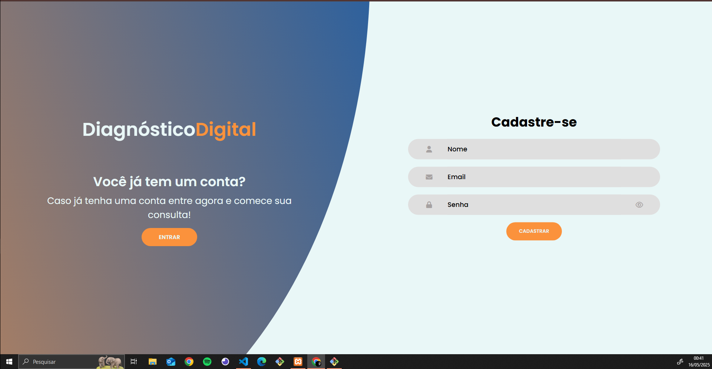

# TCC (Trabalho de Conclusão de Curso)
Em processo de desenvolvimento

## Integrantes: 
* Pedro Duarte, 
* Rodrigo Passberg, 
* Lizzie de Sousa,
* Mellyssa S.

## Instituição e Curso

Projeto desenvolvido com o intuito educacional dos alunos de Desevolvimento de Sistemas - SENAI Jaguariúna 

## Ideia do Projeto

O projeto tem com objetivo o desenvolvimento de um diagnostico digital, onde o usuário irá colocar seus sintomas e ira receber uma diagnostico baseado em uma serie de dados com um ChatBot.

## Como testar 

1. Configure o ambiente de desenvolvimento com as seguintes ferramentas.

- [VsCode](https://code.visualstudio.com/)
- [XAMPP](https://www.apachefriends.org/pt_br/index.html)
- [Git](https://git-scm.com/downloads)
- [NodeJS](https://nodejs.org/pt)

2. Após a instalação das ferramentas siga esse passo para clonar o repositorio e testa-ló.

- Copie o codigo HTTP no GitHub do repositorio que queira testar, abra o Git Bash em sua area de trabalho e coloque o seguinte codígo

```bash
git clone <https://url>
```

- Agora com o repositorio clonado, entre nela com o seguinte comando

```bash
cd <nomedoarquivo>
```

- Agora dentro do arquivo clonado pelo Git Bash, digite esse codigo para abri-lo no VsCode

```bash
code .
```

- Com o arquivo aberto no VsCode, abra o CMD (CRTL+"), e coloque os seguinte codigos na ordem que aparecem logo abaixo

```bash
cd api
npm init -y
npm i express cors mysql
npm install --save-dev nodemon
npx nodemon
```
## Requisitos funcionais 
- [RF001] O sistema deve permitir o CRUD de pacientes (Usuarios).
- [RF002] O sistema deve permitir que o ChatBot se comunique e responda o usuario.
- [RF003] O sistema deve permitir o armazenamento de novos dados.


## Tecnologias Utilizadas para o Desenvolvimento

| Linguagens e Ferramentas  | Funcionalidade |
| ------------- |:-------------:|
| [HTML](https://html.spec.whatwg.org/multipage/) | Modelo     |
| [CSS](https://www.w3.org/Style/CSS/Overview.en.html)    | Visão |
| [JavaScript (Vanilla)](https://262.ecma-international.org/)  | Controle |
| [ORM Prisma](https://262.ecma-international.org/)  | Ferramenta de source que auxilia banco de dados |
| [Vscode](https://code.visualstudio.com/)    | IDE (Ambiente integrado de desenvolvimento) |
| [Insomnia](https://insomnia.rest/download)   | Testar, criar e simular APIs |
| [NodeJS](https://nodejs.org/pt)    | Interpretar codigos em JavaScript (Vanilla) |
| [XAMPP](https://www.apachefriends.org/pt_br/index.html)    | Software que gera um servidor web local (Banco de Dados) |
| [Git](https://git-scm.com/downloads)    | Ferramenta colaborativa de versionamento |

## Github dos Desenvolvedores

* [Pedro Duarte](https://github.com/PedroDNRusso)
* [Mellyssa Silveira](https://github.com/mellyssaS)
* [Rodrigo Passberg](https://github.com/RodrigoPassberg)
* [Lizzie de Sousa](https://github.com/BigLizziee)

## Github dos Professores

* [Wellington Fábio de Oliveira Martins](https://github.com/wellifabio)
* [Lucas Paiva](https://github.com/lucasPaiva00)
* [Luís Fernando](https://github.com/luisfernandospoljaric)
* [Reenye Lima](https://github.com/ReenyeLima)
* [Robson Souza](https://github.com/robsonbsouzaa)

## Canvas e Cronograma

* [Canvas](https://wellifabio.github.io/canvas/)
* [Cronograma](https://wellifabio.github.io/gantt/)

## Progresso de Desenvolvimento

| Data  | Alterações |
| ------------- |:-------------:|
| 16/03/2025     | Começo do Projeto     |
| 17/03/2025 - 18/03/2025     | Pagina de Cadastro Pronta e Conectada com o DB  |
| 19/03/2025     | Inicio do desenvolvimento da pagina de login  |
| 22/03/2025     | Model e View da pagina Login pronta  |
| 23/03/2025     | Atualizando MV das paletas de cores, pagina de Cadastro, Login e Home  |
| 30/04/2025     | Desenvolvimento do Gant  |
| 01/05/2025     | Começo dos estudos sobre IA e implementação do ChatBot  |
| 02/05/2025     | Aprimorando o ChatBot e pagina de Login  |
| 03/05/2025     | Primeiro esboço do DCU (Diagramas de Casos de Uso)  |
| 06/05/2025     | Inicio do desenvolvimento da prototipagem (Figma)  |

## Wireframes





## ByPedroDuarte

