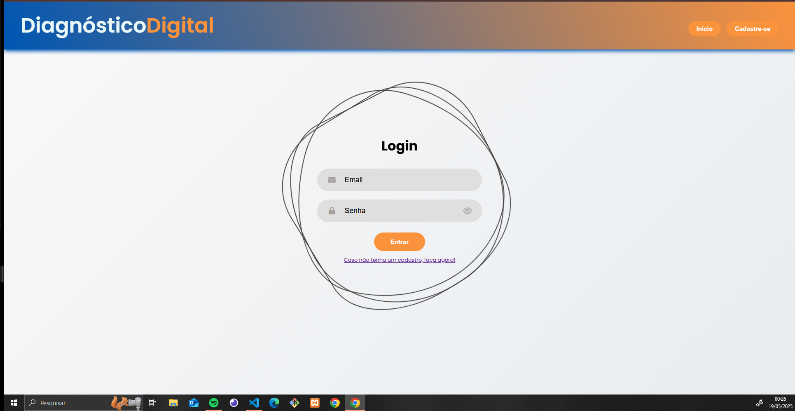
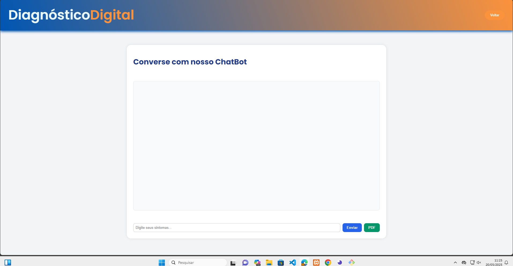

# TCC (Trabalho de Conclusão de Curso)
Em processo de desenvolvimento

## Integrantes: 
* Pedro Duarte, 
* Rodrigo Passberg, 
* Lizzie de Sousa,
* Mellyssa S.

## Instituição e Curso

Projeto desenvolvido com o intuito educacional dos alunos de Desevolvimento de Sistemas - SENAI Jaguariúna 

## Ideia do Projeto

O projeto tem com objetivo o desenvolvimento de um diagnostico digital, onde o usuário irá colocar seus sintomas e ira receber uma diagnostico baseado em uma serie de dados com um ChatBot.

## Como testar 

1. Configure o ambiente de desenvolvimento com as seguintes ferramentas.

- [VsCode](https://code.visualstudio.com/)
- [XAMPP](https://www.apachefriends.org/pt_br/index.html)
- [Git](https://git-scm.com/downloads)
- [NodeJS](https://nodejs.org/pt)

2. Após a instalação das ferramentas siga esse passo para clonar o repositorio e testa-ló.

- Copie o codigo HTTP no GitHub do repositorio que queira testar, abra o Git Bash em sua area de trabalho e coloque o seguinte codígo

```bash
git clone <https://url>
```

- Agora com o repositorio clonado, entre nela com o seguinte comando

```bash
cd <nomedoarquivo>
```

- Agora dentro do arquivo clonado pelo Git Bash, digite esse comando para abri-lo no VsCode

```bash
code .
```

- Com o arquivo aberto no VsCode, abra o CMD (CRTL+"), e coloque os seguinte comandos na ordem que aparecem logo abaixo

```bash
cd api
npm i prisma -g
npm init -y
npm i express cors dotenv
npx prisma init --datasource-provider mysql
```

- Apos colocar os comandos em ordem no CMD crie um pasta chamada .env (caso os comandos dados ja tenham criado não será necessario)

```bash
DATABASE_URL="mysql://root@localhost:3306/ddigital?schema=public&timezone=UTC"
```

- Faremos a migração do banco de dados para o MySQL através do comando a seguir no terminal

```bash
npx prisma migrate dev --name init
```

## Tecnologias Utilizadas para o Desenvolvimento

| Linguagens e Ferramentas  | Funcionalidade |
| ------------- |:-------------:|
| [HTML](https://html.spec.whatwg.org/multipage/) | Modelo     |
| [CSS](https://www.w3.org/Style/CSS/Overview.en.html)    | Visão |
| [JavaScript (Vanilla)](https://262.ecma-international.org/)  | Controle |
| [Figma](https://www.figma.com/pt-br/)    | Ferramenta de design de UI e UX |
| [ORM Prisma](https://262.ecma-international.org/)  | Ferramenta de source que auxilia banco de dados |
| [Vscode](https://code.visualstudio.com/)    | IDE (Ambiente integrado de desenvolvimento) |
| [Insomnia](https://insomnia.rest/download)   | Testar, criar e simular APIs |
| [NodeJS](https://nodejs.org/pt)    | Interpretar codigos em JavaScript (Vanilla) |
| [XAMPP](https://www.apachefriends.org/pt_br/index.html)    | Software que gera um servidor web local (Banco de Dados) |
| [Git](https://git-scm.com/downloads)    | Ferramenta colaborativa de versionamento |

## Github dos Desenvolvedores

* [Pedro Duarte](https://github.com/PedroDNRusso)
* [Mellyssa Silveira](https://github.com/mellyssaS)
* [Rodrigo Passberg](https://github.com/RodrigoPassberg)
* [Lizzie de Sousa](https://github.com/BigLizziee)

## Github dos Professores

* [Wellington Fábio de Oliveira Martins](https://github.com/wellifabio)
* [Lucas Paiva](https://github.com/lucasPaiva00)
* [Luís Fernando](https://github.com/luisfernandospoljaric)
* [Reenye Lima](https://github.com/ReenyeLima)
* [Robson Souza](https://github.com/robsonbsouzaa)

## Canvas e Cronograma

* [Canvas](https://wellifabio.github.io/canvas/)
* [Cronograma](https://wellifabio.github.io/gantt/)

Para visualizar nosso canvas e calendario de desenvolvimento vá até [DOCS](https://github.com/PedroDNRusso/TCC-DS/tree/main/DOCS).

## Diagrama e MERxDER


## Requisitos Sprint 1
- [x] Escolher a metodologia **SCRUM, KANBAN, XP, outras**
- [x] Definir **Papéis e responsabilidades**
- [x] Apresentar a proposta inicial
* [Slide](https://github.com/PedroDNRusso/TCC-DS/blob/main/DOCS/Metodologia.pdf)

## Requisitos - Sprint 2
- Metodologia: SCRUM
- Tema inicial: Diagnostico Rápido (Saúde relação entre paciente e médico)
- Alunos: Melissa|PO|, Lizzie|Full Stack|, Pedro|Scrum Master|, Rodrigo|Back End - QA|
- [Repositório github](https://github.com/PedroDNRusso/TCC-DS.git)
- [x] Modelar o negócio no **[Canvas](https://wellifabio.github.io/canvas/)**
- [x] Criar um cronograma **[Gráfico Gant](https://wellifabio.github.io/gantt/)**
- [x] Criar um repositório no **github** e adicionar os integrantes do grupo como colaboradores.
    - [x] Enviar o link do repositório neste **[FORMS](https://docs.google.com/forms/d/e/1FAIpQLSdQFCwZJLTHT7JLSeKzwsJa9NJqV4QQ1FKrmGqT6vaZVynukw/viewform?usp=dialog)**
- [ ] **Protótipo** funcional inicial (Com Figma - Mobile e Web)    
    - [x] Web
    - [ ] Mobile
- [x] Elencar os **[requisitos funcionais como neste exemplo](./requisitos.md)**. 
    - [x] Ilustrar cada **requisito funciional** com [DCU (Diagrama de casos de Uso)](https://github.com/wellifabio/senai2024/tree/main/ds/3des/03-rms/aula02)
- [x] Modelar o banco de dados MER x DER
- [x] Cadastrar os integrantes do grupo nas ferramentas de gestão de projeto escolhida Trello, Jira, Asana, etc.
* [Slide](https://github.com/PedroDNRusso/TCC-DS/blob/main/DOCS/Diagnostico.pdf)

### Requisitos funcionais
- [RF001] O sistema deve permitir o CRUD de pacientes.
- [RF002] O sistema deve permitir o CRUD de enfermeiro(a).
- [RF003] O sistema deve permitir o CRUD de médico(a).
- [RF004] O sistema deve associar o paciente a um enfermeiro(a) ou médico(a).
- [RF004.1] O sistema deve permitir apenas a inclusão de um paciente por enfermeiro e médico.
- [RF004.2] O sistema deve permitir o compartilhamento de dados da triagem com o médico.


## Wireframes







## Progresso de Desenvolvimento

| Data  | Alterações |
| ------------- |:-------------:|
| 16/03/2025     | Começo do Projeto     |
| 17/03/2025 - 18/03/2025     | Pagina de Cadastro Pronta e Conectada com o DB  |
| 19/03/2025     | Inicio do desenvolvimento da pagina de login  |
| 22/03/2025     | Model e View da pagina Login pronta  |
| 23/03/2025     | Atualizando MV das paletas de cores, pagina de Cadastro, Login e Home  |
| 30/04/2025     | Desenvolvimento do Gant  |
| 01/05/2025     | Começo dos estudos sobre IA e implementação do ChatBot  |
| 02/05/2025     | Aprimorando o ChatBot e pagina de Login  |
| 03/05/2025     | Primeiro esboço do DCU (Diagramas de Casos de Uso)  |
| 06/05/2025     | Inicio do desenvolvimento da prototipagem (Figma)  |
| 07/05/2025     | Aplicando a ORM Prisma e configurando pagina de Login  |
| 09/05/2025     | Pagina de login funcional  |
| 10/05/2025     | Alterações no ChatBot  |
| 12/05/2025     | Desenvolvendo DC (Diagrama de Classe) e MERxDER  |
| 13/05/2025     | Grafico Gant   |
| 14/05/2025     | Desenvolvimento do DCU e aplicação de tarefas em Gant   |
| 15/05/2025     | Cadastro Front-End testes   |
| 16/05/2025     | Testando aplicações em UI   |
| 18/05/2025     | Desenvolvimento de UI (User Interface)   |

## ByPedroDuarte
